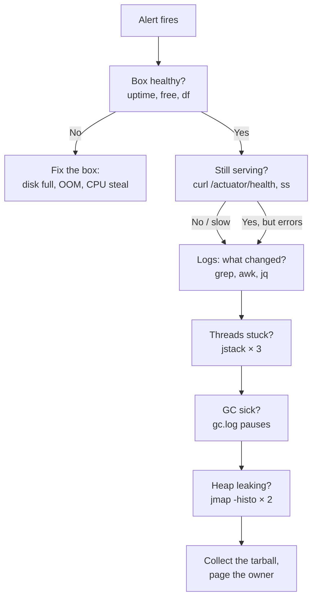

It's 3 A.M. PagerDuty is screaming, the error rate graph looks like a hockey stick, and your Java service is dying. You have SSH, a shell, and about ten minutes before someone important wakes up.

This is the triage ladder I actually run, in order, with the exact one-liners. The order matters: every step rules out a class of problem before you spend time on the next one. If you did the hardening from the [Linux Server Setup](/posts/linux-server-setup-vps-hardening/) post, this is its companion — that one was pre-incident, this one is during.



## Step 0: Find the process, stop guessing

```bash
PID=$(pgrep -f 'myservice.jar'); echo $PID
ps -o pid,etime,%cpu,%mem,cmd -p $PID
```

Sample output:

```
  PID ELAPSED %CPU %MEM CMD
 1234 21:14:03 340  68.2 java -Xmx4g -jar myservice.jar
```

`%CPU 340` on an 8-core box is fine. `ETIME` tells you whether it just restarted (deploy gone wrong? OOMKilled five minutes ago?). Note the PID — everything below uses it.

## Step 1: Is it the box?

Rule out the machine before you blame the JVM. Thirty seconds:

```bash
uptime && nproc && free -h && df -h / | tail -1
```

What you're reading:

```
 03:12:44 up 96 days,  4:20,  1 user,  load average: 14.2, 9.8, 6.1
 8
               total        used        free
 Mem:            16Gi       15Gi       212Mi
 /dev/vda1        59G         57G       2.0G  97% /
```

Load average 14 on 8 cores, 212 MB free, disk 97% full — that's three separate emergencies wearing a trench coat. Each has a one-liner to confirm:

```bash
# What's eating CPU right now?
ps -eo pid,%cpu,%mem,etime,cmd --sort=-%cpu | head -8

# What's eating memory? (sorted, human-readable)
ps -eo pid,%mem,rss,cmd --sort=-%mem | head -8 | awk '{printf "%s %s%% %sMB %s\n", $1, $2, $3/1024, $5}'

# What's eating disk? (top 10 dirs, one level)
du -xh --max-depth=2 /var 2>/dev/null | sort -rh | head -10

# Disk latency — is the disk itself slow, or just full?
iostat -x 1 3 | awk '/vda/ {print "await:", $10"ms", "util:", $NF"%"}'
```

The classic 3 A.M. killer is a full disk: logs nobody rotated, and then the JVM can't write GC logs, can't write heap dumps, and starts throwing in creative ways. If `df` shows 100%, your next command is `journalctl --vacuum-size=500M` or truncating the runaway log — *then* you restart the service.

## Step 2: Is it still serving?

Box is fine? Check whether the service answers at all:

```bash
curl -s -o /dev/null -w "code=%{http_code} time=%{time_total}s\n" \
  --max-time 10 http://localhost:8080/actuator/health

# Connection states — the shape of the traffic tells the story
ss -tan | awk 'NR>1 {print $1}' | sort | uniq -c | sort -rn

# TIME_WAIT flood? (short-lived connections churning)
ss -tan state time-wait | wc -l
```

Sample of a service that's alive but drowning:

```
code=200 time=9.842s
  812 ESTAB
  431 TIME-WAIT
   12 LISTEN
```

Health endpoint answers in 9.8 seconds with 812 established connections — the app is alive but every request is queueing. That points at thread pool exhaustion or a downstream dependency holding connections open, which is exactly what steps 3 and 4 confirm.

## Step 3: Log triage — what changed?

Don't read logs. *Query* them. The question is always the same: **what changed, and when did it start?**

### Plain-text Spring Boot logs

```bash
# Exception histogram — what's actually being thrown?
grep -oE '[A-Za-z0-9_.$]+Exception' app.log | sort | uniq -c | sort -rn | head

# When did the FIRST error appear? (root cause is usually the first, not the loudest)
grep -m1 -n "ERROR" app.log

# Errors per minute — find the minute the hockey stick started
grep "ERROR" app.log | cut -c1-16 | sort | uniq -c | sort -k2 | tail -20

# What was the last thing that worked? (correlate with deploys/restarts)
grep -E "Started Application|Started MyServiceApplication" app.log | tail -3
```

### JSON logs (Logstash encoder) with jq

```bash
# Top 10 error messages in the incident window
jq -r 'select(.level=="ERROR") | .message' app.json.log \
  | sort | uniq -c | sort -rn | head -10

# Slowest endpoints right now (poor man's p99)
jq -r 'select(.uri != null) | "\(.duration_ms) \(.method) \(.uri)"' app.json.log \
  | sort -rn | head -15

# Which endpoint started failing FIRST?
jq -r 'select(.level=="ERROR") | "\(.timestamp[0:16]) \(.uri)"' app.json.log \
  | sort | uniq | head -10

# Error rate per minute, last 200 lines of context
tail -5000 app.json.log \
  | jq -r 'select(.level=="ERROR") | .timestamp[0:16]' \
  | sort | uniq -c
```

Sample output that tells the whole story:

```
   1843 Connection refused: db-primary.internal:5432
     12 HikariPool - Connection is not available, request timed out after 30000ms
```

1843 "connection refused" to the database, 12 pool timeouts. The database went away at 03:04, the pool drained, and now every request thread is parked waiting for a connection. You don't need step 4 — but run it anyway to confirm, because "the DB is down" is a conclusion you want evidence for.

## Step 4: Thread dumps — where are the threads stuck?

One dump is a photo; three dumps 30 seconds apart is a movie. Stuck threads have identical stacks across all three.

```bash
for i in 1 2 3; do
  jstack $PID > /tmp/td-$i.txt
  sleep 30
done
# No jstack on the box? (JDK 16+)
jcmd $PID Thread.print > /tmp/td-1.txt
```

Now interrogate them:

```bash
# Thread state histogram — the single most informative one-liner
grep -E '^   java.lang.Thread.State' /tmp/td-1.txt | sort | uniq -c | sort -rn

# Which lock are the BLOCKED threads fighting over?
grep "waiting to lock" /tmp/td-1.txt | sort | uniq -c | sort -rn | head -5

# What are the RUNNABLE threads actually doing? (CPU spin = same method everywhere)
grep -A 2 'java.lang.Thread.State: RUNNABLE' /tmp/td-1.txt \
  | grep 'at com\.' | sort | uniq -c | sort -rn | head -10

# Deadlock? (the JVM tells you for free — most people never look)
grep -A 25 "Found one Java-level deadlock" /tmp/td-1.txt | head -30

# Which threads appear in all three dumps with the same stack? (the stuck ones)
for f in /tmp/td-*.txt; do grep '^"' $f | cut -d'"' -f2 | sort > /tmp/names-$(basename $f); done
comm -12 /tmp/names-td-1.txt /tmp/names-td-2.txt | head
```

Learn to read the histogram at a glance:

| Histogram | Diagnosis |
|---|---|
| 180 `TIMED_WAITING`, 8 `RUNNABLE` | Healthy-ish pool waiting on work |
| 150 `BLOCKED` on one lock | Lock contention — find the lock holder |
| 200 `WAITING` on `HikariPool` | Pool exhausted — downstream is slow/down |
| 8 `RUNNABLE`, all in the same `at com.` line | CPU spin — infinite loop or pathological regex |
| `parking` on `CompletableFuture` everywhere | Async pipeline stalled on one stage |

The DB-outage scenario from step 3 shows up here as hundreds of threads `WAITING` on the Hikari pool — confirmation, not a new mystery.

## Step 5: GC logs — is the JVM sick?

If threads look fine but latency is terrible, the garbage collector is the next suspect. You are looking for two things: long pauses and allocation pressure.

```bash
# Worst pauses in the log (unified logging, -Xlog:gc*)
grep -oE "Pause [A-Za-z ]+\([0-9.]+ms\)" gc.log \
  | grep -oE "[0-9.]+ms" | sort -rn -t'm' -k1 | head -5

# How often are we pausing? (pauses per minute during the incident)
grep -c "Pause Young" gc.log

# Allocation pressure signals
grep -c "Promotion Failed" gc.log
grep -c "to-space exhausted" gc.log

# Heap trend — is the used heap climbing toward the max after every GC?
grep "Pause Full" gc.log | tail -5
```

A healthy service shows young pauses in single-digit ms and full GCs rarely. The sick pattern: `Pause Full (45.2s)`, `to-space exhausted` repeating, heap used climbing after every collection — that's a memory leak wearing a GC problem costume, which takes you to step 6.

No GC logging enabled? Fix that *after* the incident — it's a one-line JVM flag (`-Xlog:gc*:file=/var/log/myservice/gc.log:time,uptime,level,tags:filecount=5,filesize=100m`) and it's the difference between a 10-minute diagnosis and a 3-hour one next time.

## Step 6: Heap — what's actually in there?

```bash
# Top object types by heap usage
jmap -histo $PID | head -15

# Take two, five minutes apart — the climber is your leak
jmap -histo $PID > /tmp/histo-1.txt; sleep 300; jmap -histo $PID > /tmp/histo-2.txt
diff /tmp/histo-1.txt /tmp/histo-2.txt | head -20
```

Sample of a leak caught red-handed:

```
 num     #instances         #bytes  class name
   1:       4120034      659205544  [B
   2:       1892231      151378480  com.example.OrderDTO
```

`OrderDTO` instances in the millions on a service that processes hundreds of orders a minute — something is retaining them. A cache without eviction, a listener list that only grows, a `ThreadLocal` that never clears. The histogram won't name the retainer (that's a heap dump + Eclipse MAT job for business hours), but it tells you *what* is leaking, which is usually enough to find the code.

> ⚠️ `jmap -histo` triggers a full GC and briefly pauses the JVM. On a dying service that's already pausing, it's acceptable triage — but never run `jmap -dump` (full heap dump) on a production box during an incident unless you've accepted the pause. Take the dump from a canary or staging instead.

## Step 7: The 60-second triage script

Everything above, collected in one shot. Save it as `triage.sh` on every box you own:

```bash
#!/usr/bin/env bash
# triage.sh <pid> — collect everything in ~60s, tarball it, get out of the way
set -u
PID=${1:?usage: triage.sh <pid>}
OUT=/tmp/triage-$(date +%Y%m%d-%H%M%S); mkdir -p "$OUT"

{
  echo "=== $(date -u) ==="
  uptime; free -h; df -h / | tail -1
  echo "--- top cpu ---"; ps -eo pid,%cpu,%mem,etime,cmd --sort=-%cpu | head -6
  echo "--- connections ---"; ss -tan | awk 'NR>1{print $1}' | sort | uniq -c
} > "$OUT/box.txt" 2>&1

curl -s -o /dev/null -w "health: %{http_code} in %{time_total}s\n" \
  --max-time 10 http://localhost:8080/actuator/health > "$OUT/health.txt" 2>&1

for i in 1 2 3; do jstack "$PID" > "$OUT/threaddump-$i.txt" 2>&1; sleep 20; done
jmap -histo "$PID" > "$OUT/histo.txt" 2>&1
grep -E '^   java.lang.Thread.State' "$OUT/threaddump-1.txt" \
  | sort | uniq -c | sort -rn > "$OUT/thread-states.txt"
grep "waiting to lock" "$OUT/threaddump-1.txt" \
  | sort | uniq -c | sort -rn | head -5 > "$OUT/locks.txt"

tar -czf "$OUT.tar.gz" -C /tmp "$(basename "$OUT")"
echo "collected: $OUT.tar.gz"
```

Run it, attach the tarball to the incident ticket, *then* start theorizing. Future-you at 9 A.M. will be grateful.

## The interview answer

**"Walk me through how you'd debug a slow production service."**

> "Box first, app second. I'd check load, memory, and disk — a full disk or OOM-killed process explains a lot of 'slow app' mysteries. Then I'd hit the health endpoint and look at connection states to see if it's alive-but-queueing. Then logs, but queried not read: exception histogram, errors-per-minute to find when it started, first error not the loudest one. If the app is the problem, three thread dumps thirty seconds apart — stuck threads have identical stacks — plus the thread-state histogram, which tells me pool exhaustion versus lock contention versus CPU spin at a glance. Then GC pauses and a jmap histogram for leaks. And I'd collect all of it into a tarball before theorizing, because incidents are for evidence, not hypotheses."

That's a 60-second answer that signals you've actually been on call.

## Checklist before the next 3 A.M.

- [ ] GC logging on (`-Xlog:gc*` with rotation) — non-negotiable
- [ ] JSON logs or at least consistent timestamps — `jq` can't save you from chaos
- [ ] `triage.sh` on every box, tested once while calm
- [ ] Log rotation configured (the full-disk outage is *always* embarrassing)
- [ ] Actuator health endpoint exposed locally
- [ ] Know your `jstack`/`jcmd`/`jmap` paths — don't discover them during the incident

The best triage is the one you never run because the hardening post did its job. But when PagerDuty screams anyway, work the ladder: box, serving, logs, threads, GC, heap. In that order, every time.
